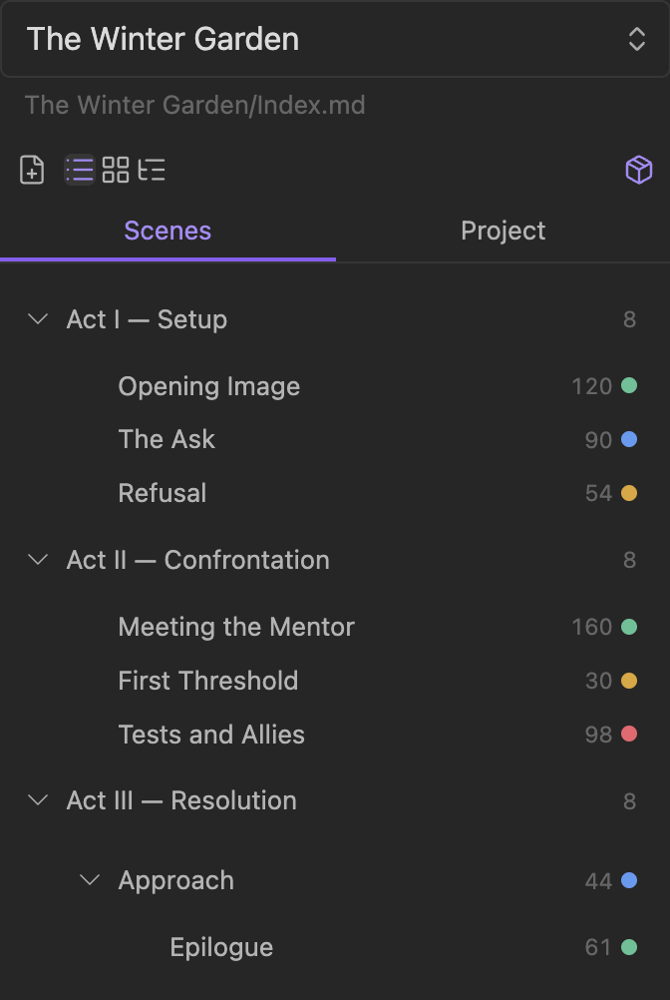
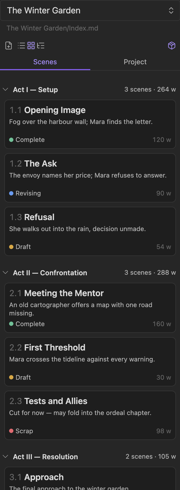
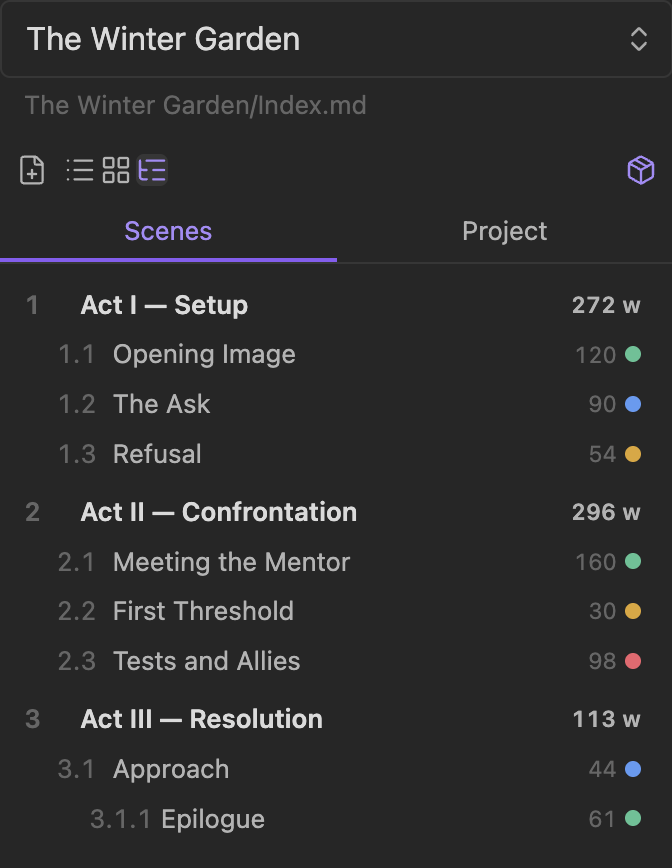
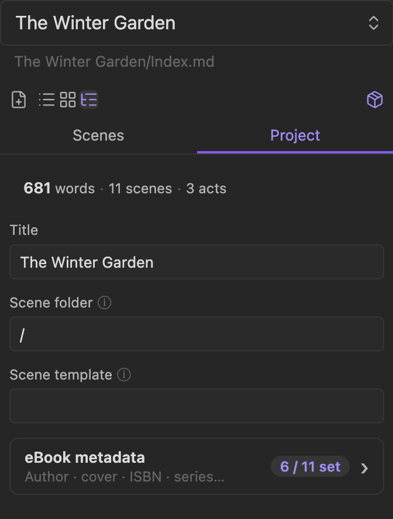
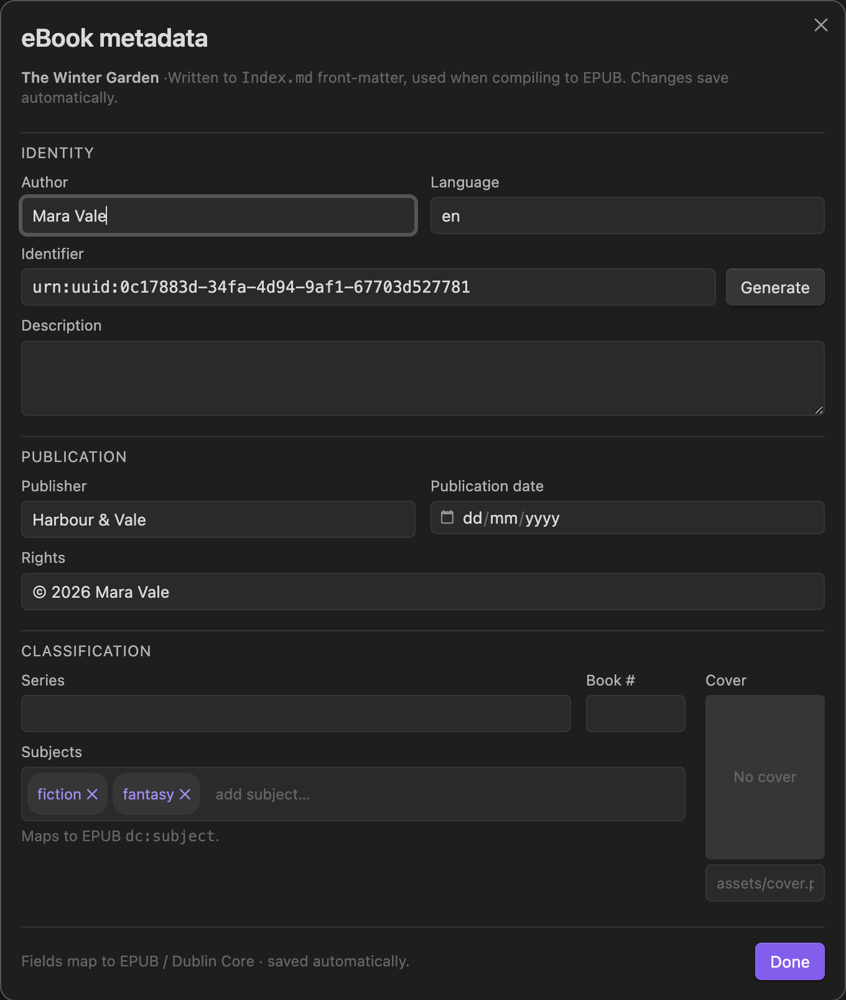
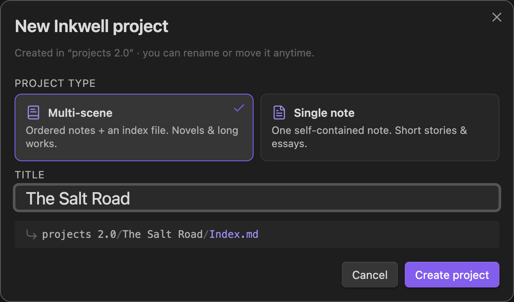
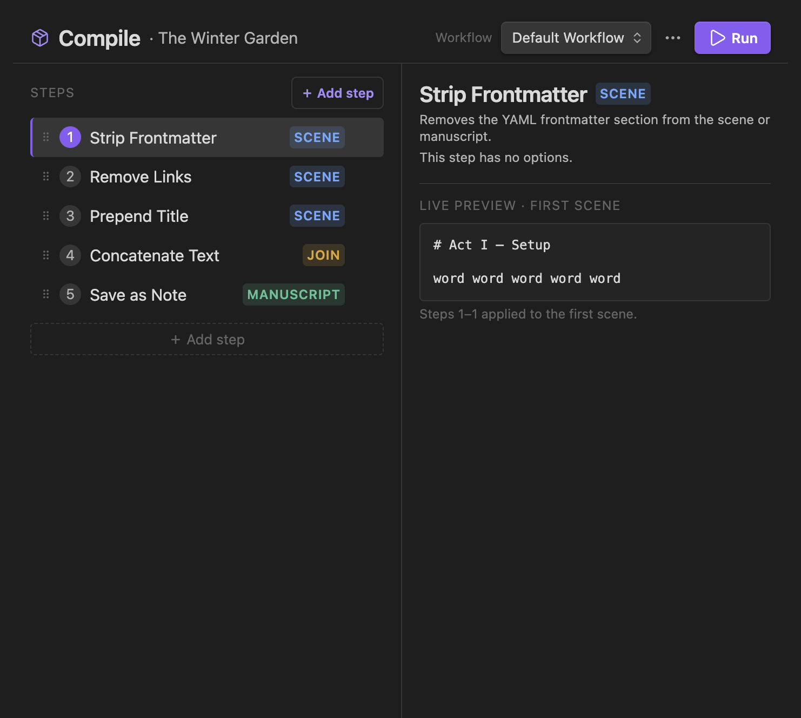

# Interface guide

Inkwell lives in a single sidebar pane plus a full-pane **Compile builder**. This
page walks through every surface. Inkwell rides Obsidian's theme variables, so
everything below adapts to your theme and accent colour — the screenshots use the
default dark theme.

> New to the on-disk format? The `Index.md` frontmatter schema is covered in the
> [main README](../README.md#schema-vs-upstream-longform-2x). This guide is about
> the UI. For the story behind the redesign, see [The UI redesign](./ui-redesign.md).

## Contents

- [The sidebar at a glance](#the-sidebar-at-a-glance)
- [Scenes: List, Cards, Outline](#scenes-list-cards-outline)
- [Scene status colours](#scene-status-colours)
- [The Project tab](#the-project-tab)
- [eBook metadata modal](#ebook-metadata-modal)
- [Creating a project](#creating-a-project)
- [The Compile builder](#the-compile-builder)

## The sidebar at a glance

Every project surface hangs off one pane. From top to bottom:

1. **Project picker** — a dropdown of every Inkwell project in the vault, with the
   selected project's `Index.md` path shown beneath it.
2. **Action toolbar** — icon buttons directly under the picker: **New scene**, the
   **List · Cards · Outline** view switcher, and **Open compile builder** (the box
   icon, far right). Icons only, so the row never wraps.
3. **Scenes / Project tabs** — an equal-width, underline-style tab bar.

A single-note project skips the tabs and toolbar and shows the Project fields
directly, because there are no scenes to list.

## Scenes: List, Cards, Outline

The Scenes tab renders your scene hierarchy three ways. The view switcher in the
toolbar toggles between them and your choice is remembered. All three read the same
data: scene order and nesting from `Index.md`, the display title from each scene's
`frontmatter.title` (falling back to the filename), the word count from Inkwell's
tracker, and the status from each scene's `status:` frontmatter.

Scenes are grouped into **Acts** — every top-level (un-indented) scene starts a new
act, and the scenes nested under it become its members.

| List — the default | Cards — visual, wide | Outline — full depth |
|---|---|---|
|  |  |  |
| Compact rows with a status dot and word count. Collapsible act headers show a scene count. | Each scene is a card with its number, title, a synopsis line, a status label, and its word count. Acts are collapsible with per-act word subtotals. | An indented tree with hierarchical numbering (`1`, `1.1`, `3.1.1`), status dots, word counts, and rolled-up act totals — the view for deeply nested work. |

Cards and Outline cap the visible nesting at two levels for scannability (Outline
still shows deeper numbering). **New scene** (the toolbar's file-plus icon) opens an
inline input at the top of the list; press Escape or blur it empty to dismiss.

### Reordering

Scene rows are drag-to-reorder and drag-to-nest. A grab handle appears on hover so
the interaction is discoverable — drag a row up/down to reorder, or right/left to
change its nesting (which act it belongs to).

## Scene status colours

Give any scene a `status:` value in its frontmatter and Inkwell renders a
colour-coded dot and label wherever that scene appears:

| `status:` | Colour | Meaning |
|---|---|---|
| `draft` | 🟡 amber | first pass |
| `revising` | 🔵 blue | being revised |
| `complete` | 🟢 green | done |
| `scrap` | 🔴 red | cut / parked |

```yaml
---
title: Opening Image
status: complete
---
```

Any other value gets a neutral dot. The colours are plain CSS custom properties
(`--inkwell-status-*`) declared at `:root`, so you can override them in a vault
snippet. Status is first-class now — no snippet required to see it.

## The Project tab

The Project tab is deliberately lean: a one-line overview and the essentials.



- **Overview** — `words · scenes · acts` for the whole project.
- **Title**, **Scene folder**, **Scene template** — the core fields. Longer
  explanations sit behind an ⓘ affordance instead of permanent paragraphs of faint
  help text.
- **eBook metadata launcher** — a card showing how many of the eleven eBook fields
  are set (`6 / 11 set`) that opens the metadata modal.

## eBook metadata modal

eBook / Dublin Core metadata is a first-class part of an Inkwell project. Rather
than stack eleven fields in the narrow sidebar, Inkwell edits them in a wide modal.



Fields are grouped into **Identity** (author, language, identifier, description),
**Publication** (publisher, publication date, rights), and **Classification**
(series, book number, subjects, cover):

- **Subjects** are entry chips — type and press Enter to add, click × to remove.
  They map to EPUB `dc:subject`.
- **Cover** shows a live thumbnail with a file picker.
- **Generate** creates a `urn:uuid:` identifier.

Everything **saves automatically** to `Index.md` frontmatter as you type — the
same top-level keys the compile step reads when producing an EPUB. There is no
sidecar file.

## Creating a project

Three entry points create a project:

- The **command** "Inkwell: Create new project" (pick a folder, then fill the modal).
- **Right-click a folder** in the file explorer → the Inkwell create action.
- The **empty state** in the picker when the vault has no projects yet — an icon,
  one line, and a **＋ New project…** button.

All three open the same action-first modal:



Pick a **type** — Multi-scene (ordered notes + an index file) or Single note — as a
selectable card, type a **title**, and watch the **live path preview** update.
**Create project** is always visible (disabled until the title is valid).

## The Compile builder

Compile is a full workspace pane, not a cramped sidebar column. Open it from the
toolbar's box icon or the "Inkwell: Open compile builder" command.



- **Top bar** — the project name, a workflow picker, an overflow menu, and **Run**
  (always reachable).
- **Steps (left)** — one compact row per step: ordinal, name, a **colour-coded kind
  pill** (Scene = blue, Join = amber, Manuscript = green), a drag handle, and remove.
  Select a row to configure it.
- **Config (right)** — options for the *selected* step only, so a long workflow no
  longer means an endless scroll.
- **Live preview** — the selected step (and the Scene-kind steps before it) applied
  to your first scene, so you can see the effect before running. Steps with side
  effects (Join / Manuscript / Save) are never executed for the preview.
- **Status bar** — validity and a step breakdown (`5 steps · Scene ×3 · Join ×1 ·
  Manuscript ×1`).

The compile-step API is unchanged from Longform, so the community
[collection of compile steps](https://github.com/obsidian-community/longform-compile-steps)
still applies.
