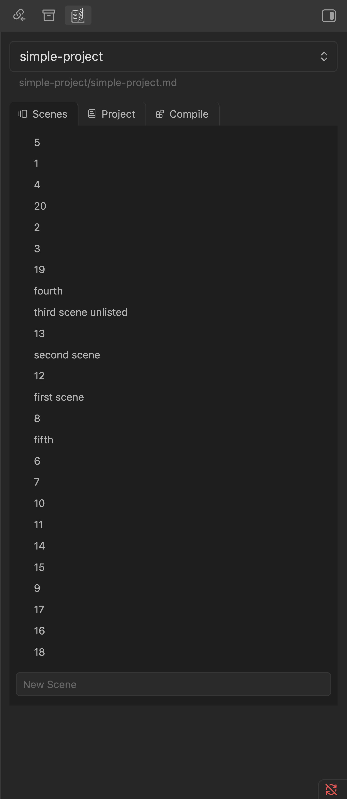
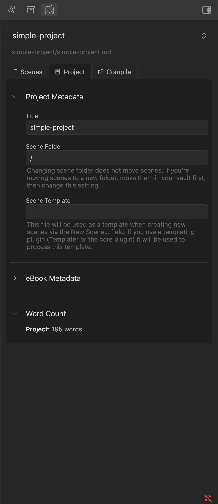
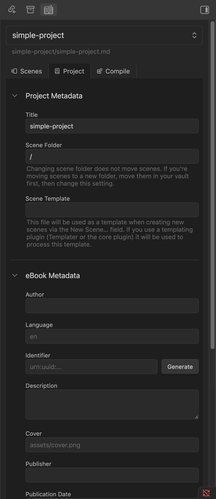
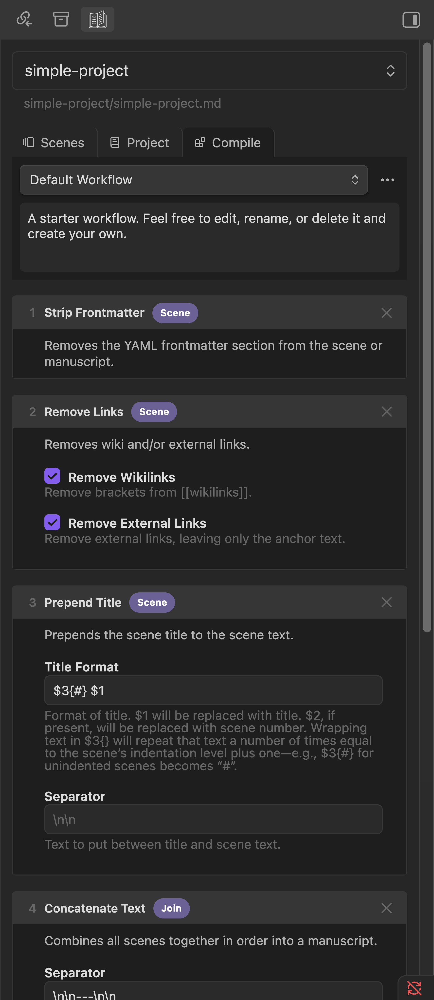
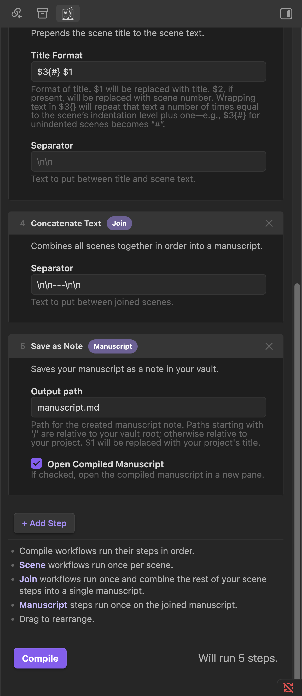
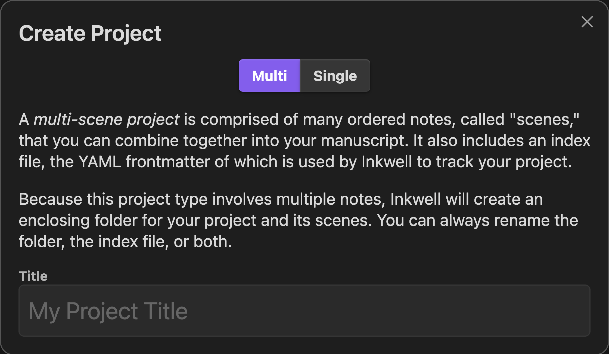
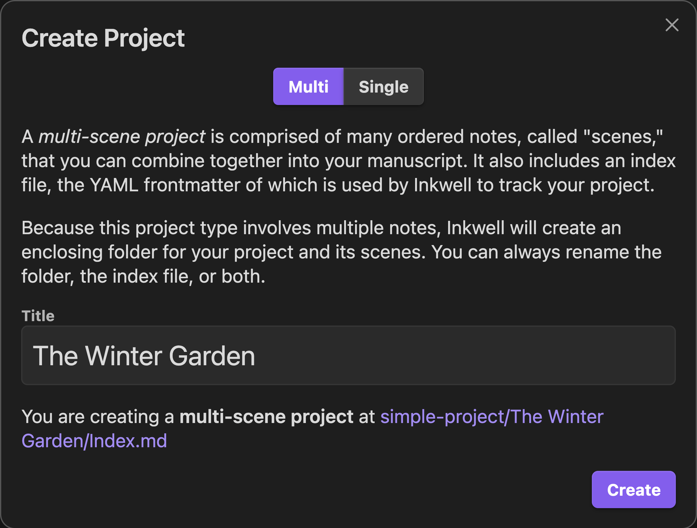

# The UI redesign

Inkwell began as a fork of [Longform](https://github.com/kevboh/longform). The
on-disk schema diverged first (see the [README](../README.md)), but the interface
was inherited wholesale and had never had a design pass. In `2.0.0` Inkwell
replaced essentially every writing surface with a purpose-built implementation.

This page is the before/after. The redesign was driven by a written audit and a set
of mockups, both kept in the repo as reference:

- **[`ui-audit/README.md`](ui-audit/README.md)** — a heuristic design & usability
  audit of the inherited UI (Nielsen, Gestalt, Fitts, WCAG, plus Obsidian's own
  conventions), with the "before" screenshots in [`ui-audit/screens/`](ui-audit/screens).
- **[`ui-audit/mockups/`](ui-audit/mockups/MOCKUPS.md)** — the wireframes that set
  the direction (open [`index.html`](ui-audit/mockups/index.html) to view them).

> The "before" images below come from `ui-audit/screens/`; the "after" images are
> the shipped `2.0.0` UI. Both are the default Obsidian dark theme.

## What the audit found

The inherited UI **worked** and was theme-correct, but three problems dominated
(full write-up in [the audit](ui-audit/README.md)):

1. **No hierarchy** — primary content sat at the same weight as secondary chrome;
   large blocks of faint gray help text competed with the actual data.
2. **Density in the wrong container** — the Project, eBook (11 stacked fields), and
   Compile surfaces were editing-heavy but trapped in a ~300 px scrolling sidebar.
3. **Missing signifiers** — the scene list was silently drag-reorderable, several
   primary actions were styled as text links, and compile "kind" pills were all one
   colour so the colour meant nothing.

Plus one real layout **bug**: the tab bar wrapped at the default sidebar width.

## Finding → change

| Audit finding | What shipped |
|---|---|
| Tab bar wraps at ~290 px | Icon-only action toolbar + equal-width underline tabs — never wraps |
| Scene list is a flat wall of same-weight rows | Three views (List / Cards / Outline) with acts, numbering, synopsis |
| Word count & status tracked but not shown | Per-scene word count + colour-coded status dot in every view |
| Drag-to-reorder has no signifier | Grab handle + `cursor: grab` on row hover |
| eBook = 11 fields in the sidebar | Dedicated wide modal, grouped, with chips + cover thumbnail |
| Project tab buried under faint warnings | Lean one-line overview; help behind ⓘ |
| Compile is a tall scroll; Run below the fold | Full-pane two-column builder; Run always visible |
| Compile kind pills all one colour | Scene / Join / Manuscript colour-coded |
| New Project leads with two paragraphs | Action-first: type cards + title + live path; Create always shown |
| Empty state is a muted paragraph | Icon + one line + a real **＋ New project…** button |

## Before → after

### Scenes

The core view, and the weakest before: with numbering off (the default) it was an
undifferentiated wall of rows carrying no per-scene metadata — even though the
plugin already tracked word counts and read each scene's `status`. It's now three
views, all with status dots, word counts, act grouping, and discoverable drag.

| Before | After (List) | After (Cards) |
|---|---|---|
|  |  |  |

A third **Outline** view renders the full-depth hierarchy with rolled-up act totals.
And the tab-bar wrap bug is gone — the tabs are now equal-width with a single active
underline, and the actions moved to an icon-only toolbar that can't wrap (before:
[`03-scenes-narrow-tabwrap.png`](ui-audit/screens/03-scenes-narrow-tabwrap.png)).

### Project tab & eBook metadata

The Project tab was three collapsible sections dominated by multi-line faint
warnings; the eBook editor was eleven fields stacked in the sidebar. The Project tab
is now a lean overview with the essentials, and eBook editing moved to a wide,
grouped modal.

| Before — Project | Before — eBook | After — Project | After — eBook modal |
|---|---|---|---|
|  |  |  |  |

### Compile

Compile was denser and more "designed" than the rest, but still a tall scroll of
five cards with monochrome kind pills, always-on help, and a **Compile** button that
sat below the fold on any real workflow. It's now a full workspace pane: a one-line
step list on the left, config for the selected step on the right, colour-coded kinds,
a live preview, and Run always visible in the top bar.

| Before (top) | Before (bottom) | After |
|---|---|---|
|  |  |  |

### New Project

The old modal led with two dense paragraphs and only revealed **Create** after valid
input, so the empty modal had no visible primary action. It's now action-first.

| Before (empty) | Before (filled) | After |
|---|---|---|
|  |  |  |

## What carried over

The redesign is a re-skin and re-layout, not a rewrite of the engine. Unchanged:

- The compile pipeline and its **step API** — community
  [compile steps](https://github.com/obsidian-community/longform-compile-steps) still work.
- Multi-scene and single-note projects; multiple drafts grouped by title.
- Per-project / per-scene word counting.
- The `.inkwell-leaf` scene-styling hook for power users.
- Building **entirely on Obsidian CSS variables**, so the new UI stays correct across
  themes and accent colours — the audit's one unambiguous "don't lose this."

## How the screenshots are captured

Both the before and after shots were taken from the plugin running live in Obsidian,
driven over the Chrome DevTools Protocol against `test-inkwell-vault`. See
[the audit's repro note](ui-audit/README.md#how-these-were-captured-repro) for the
mechanics.
